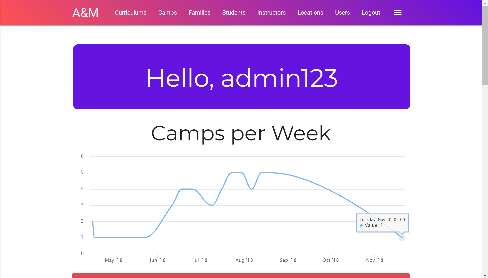
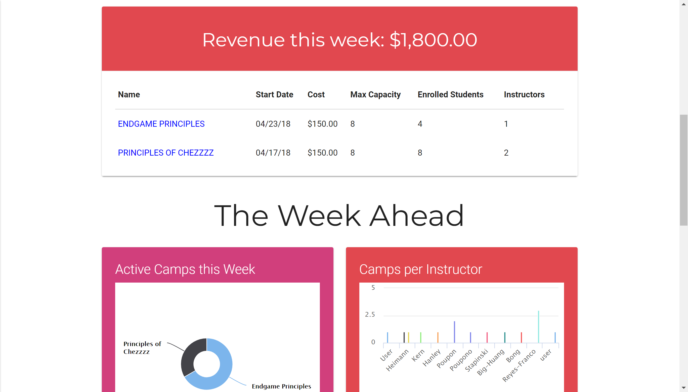
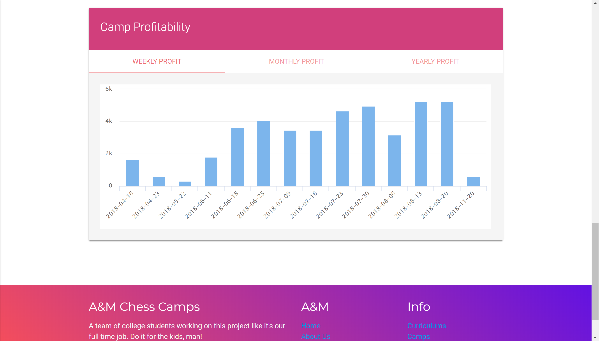
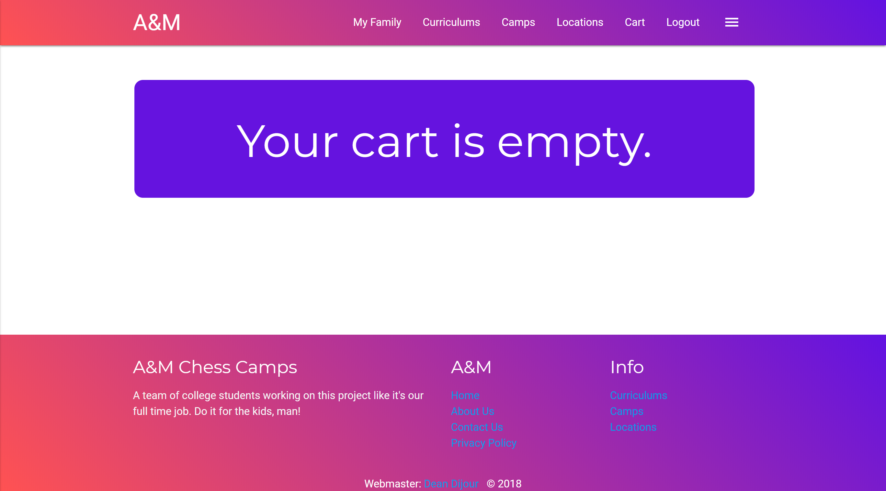
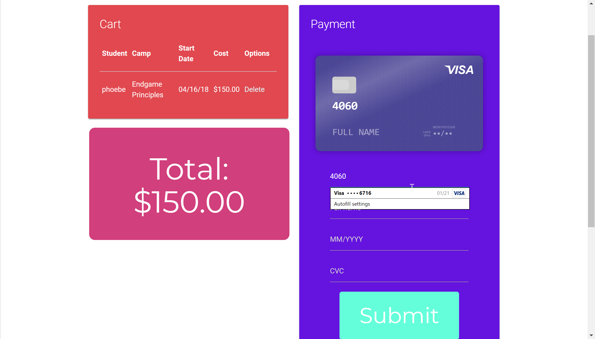
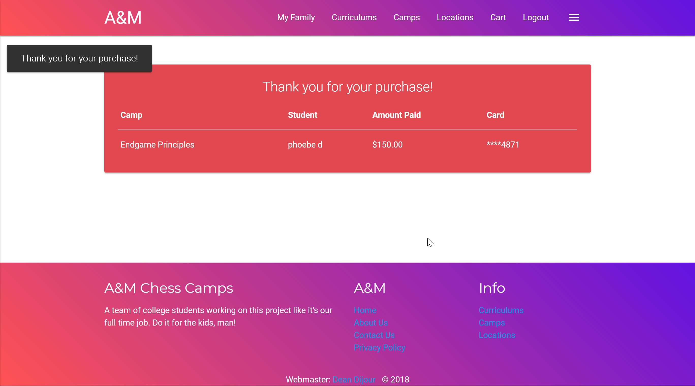

## 67-272: Chess Camp Solution to Phase 4 ##

This is a fully functional, and highly augmented solution for the course project in 67-272: Application Design and Development.  This repo contains a solution only to Phase 5 of the project.

To set this up, clone this repository, run the `bundle install` command to ensure you have all the needed gems and then create the database with `rake db:migrate`.  If you want to populate the system with fictitious, but somewhat realistic data (similar to the data given in the spreadsheets in phase 1), you can run the `rake db:populate` command.  The populate script will create a series of curriculums, instructors and over 35 camps

Many objects are created with some element of randomness so you will get slightly different results each time it is run.  However, instructors and users are fixed.  If there were any users in this phase, all the users in the system have a password of 'secret'.  In terms of users there are two admins (Alex and Mark) and five instructor-level users (the five 67-272 Head TAs).  The username for each will be their first name in all lowercase.

This project is meant to demonstrate MVC knowledge of the Ruby on Rails framework.

Key system functionalities:

1. Functional cart with visual credit card form.
2. Receipt generation based on purchases from a user's current session. Generated securely through decoding a payment receipt.
3. Card based layout with responsive pagination.
4. Charts for parents and administrators to see student registrations and A&M performance, respectively.
5. Custom routes editing just the passwords for instructors and parents.
6. Custom route for editing just the photo for instructors.
7. Best in place functionality on most show pages, with on-hover greyed-out indications to show which fields can be updated.
8. Vue JS modals have indicative text to help the user know if the modal is open/closed.
9. Vue JS modals with warnings when students or instructors cannot be added to the camps, if there are no eligble students/instructors.
10. Vue JS modals with different functionalities based on permissions. Registrations on the camp show page for parents will only add student items to the session cart, while the admin can immediately register students from that form.
11. Consistent theme styling, with a set color scheme.
12. Mobile nav bar with hamburger button, collapses when screen is shrunk.
13. Full icon set for almost all show pages to indicate what the data displayed pertains to.

Admin dashboard with populated data:

Credit card checkout form (recognized by chrome as a real credit card form) with functional receipt:

This was a fun project - it was stressful, but an excellent experience!